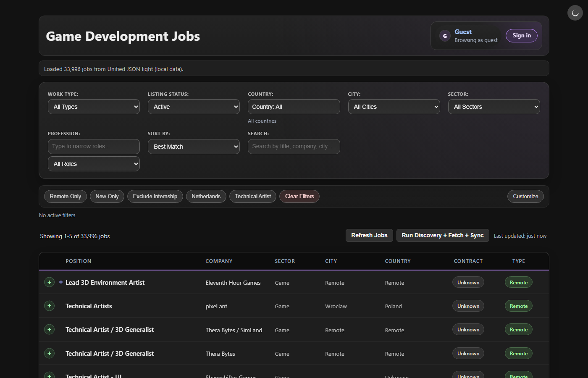
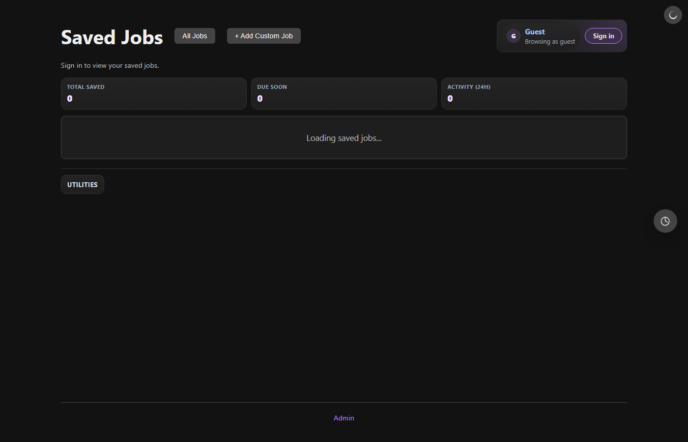
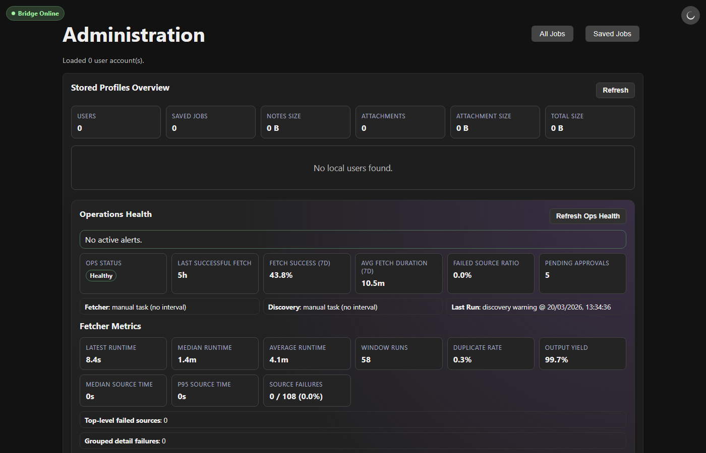

# Baluffo

[](https://opensource.org/licenses/MIT)  

## What is Baluffo? 🚀

Baluffo aggregates game development job listings from across the web into one fast, local-first app. No logins, no cloud, no hassle — just a better way to find your next game dev role.

🟢 **Local-first** &nbsp; 🔒 **No login required** &nbsp; 📦 **Portable** &nbsp; 🌙 **Dark mode** &nbsp; ✨ **Fully vibe coded**

---

## Quick Start

1. **Download** the portable EXE from [Releases](https://github.com/deathuman/Baluffo/releases)
2. **Run** — double-click `Baluffo.exe`, it opens automatically in your browser
3. **Browse** — filter by region, work type, or search text, then save jobs you like

That's it. Your data stays on your machine.

---

## Screenshots

| Jobs Page | Saved Jobs | Admin |
|:---:|:---:|:---:|
|  |  |  |

---

## Features

| 🔍 Smart Filtering | 💾 Save & Track | ⚡ Fast & Local | 🎮 Game Dev Focus |
|---|---|---|---|
| Filter by region, work type, city, sector, profession, and text search | Save jobs with notes, track application status, add custom entries | All data stored locally — no cloud, no waiting | Curated for game industry roles from studios worldwide |

| 🌍 Region-Aware | 📦 Backup & Restore | 🛠️ Source Management | 🌗 Dark Theme |
|---|---|---|---|
| Filter by continents: Europe, North America, South America, Asia, Africa, Oceania | Export to JSON or ZIP, import anytime — your data stays yours | Discover new sources, approve/reject in Admin panel | Toggle between light and dark modes |

---

## For Developers 🛠️

<details>
<summary>Click to expand — technical details</summary>

### Tech Stack

- **Frontend:** plain HTML/CSS/JavaScript with native ES modules (no framework)
- **Backend:** Python scripts and CLIs for jobs fetching, source discovery, and admin bridge
- **Storage:** localStorage + IndexedDB (browser mode), file-based (desktop mode)

### Quick Development Setup

```powershell
# Serve locally + start admin bridge (recommended)
npm run dev:bridge

# Generate jobs feed
npm run dev:pipeline
```

### Documentation

- [Docs Index](docs/INDEX.md) — navigation hub for the documentation set
- [AI Assistant Guide](docs/AI_ASSISTANT_GUIDE.md) — AI coding workflow and edit routing
- [Docs Workflow](docs/DOCS_WORKFLOW.md) — documentation ownership, freshness checks, and maintenance rules
- [Architecture Map](docs/architecture-ai-map.md) — subsystem boundaries and file routing
- [Testing Guide](docs/testing.md) — verification commands and fixture guidance
- [Admin Bridge API](docs/admin-bridge-api.md) — endpoint reference
- [Release Process](docs/RELEASE.md) — build and release guide
- [Scraping Pipeline](docs/scraping-pipeline.md) — Playwright and Scrapy flow
- [Adapter Plugin Inventory](docs/adapter-plugin-inventory.md) — source loaders and static plugins
- [Data Contracts](docs/DATA_CONTRACT.md) — data structures between Python and JS

### Project Structure

```
.
|- *.html                    # Page entry points (jobs.html, saved.html, admin.html)
|- frontend/                  # ES module frontend code
|  |- shared/                 # Shared UI components, local-data clients, config, state hub
|  |- jobs/                   # Jobs browser page + page-owned helpers (state.js, parsing-utils.js)
|  |- saved/                  # Saved jobs page + backup helpers (zip-utils.js)
|  |- admin/                  # Admin console page
|  |- local-data/             # Browser IndexedDB adapter
|- .tmp/                      # Repo-owned temp roots (pytest, Playwright, packaged smoke probes)
|- src/
|  |- jobs_fetcher.py         # Build unified jobs feed
|  |- source_discovery.py     # CLI entrypoint for source discovery
|  |- admin_bridge.py         # Local admin HTTP API entrypoint
|  |- bridge/                 # Bridge service modules (server/, api.py, ops_api.py, etc.)
|  |- source_discovery/       # Source discovery package (orchestrator, probe, web_search, etc.)
|  |- jobs/                   # Job pipeline and adapters
|  |  |- adapters/            # Source adapters (static, provider, social)
|  |  |  |- plugins/          # Adapter plugins (provider_api/, social/, static/)
|  |  |- common/              # Jobs package helpers (config, contracts, heuristics, etc.)
|  |- core/                   # Core schemas and contracts (Pydantic models)
|  |- shared/                 # Shared utilities (regex, utils, exceptions)
|  |- scrapers/               # Scrapy runner and spiders
|  |- ship/                   # Desktop packaging
|- scripts/                   # Build/orchestration scripts
|- probes/                    # Development/testing probes
|- docs/                      # Documentation
|- data/                      # Jobs feed outputs, source registries
```

### Running Tests

```powershell
npm run verify        # Full build + test suite
npm run test:py      # Python tests
npm run test:unit    # Frontend unit tests
```

### Configuration

- Default config: `baluffo.config.json`
- Local overrides: `baluffo.config.local.json` (not committed)
- Config precedence: CLI → env → local config → committed config

</details>

---

## License

This project is licensed under the MIT License. See the [LICENSE](LICENSE) file for details.

---

## Notes

- This project is optimized for local/personal operation
- Third-party source reliability may vary (rate limits, anti-bot, temporary failures)
- Always verify critical job details on the original posting
- Source registry sync is transition-aware: local delete is tombstone-backed, and remote sync snapshots only carry `active` and `pending` rows.
